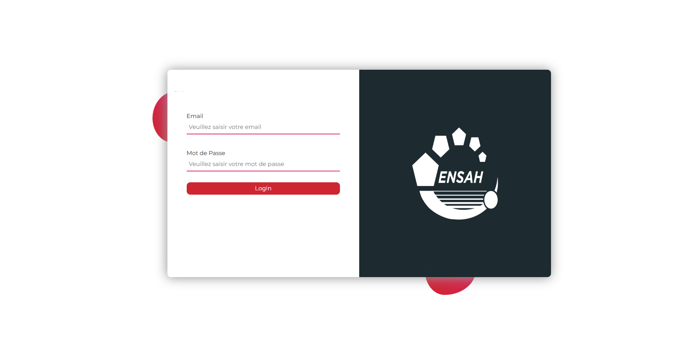

# Study Manager
---
> A web-based academic management platform designed to centralize and simplify the management of students, professors, courses, grades, absences, announcements, reports, rooms, and academic communication.

## Overview

`Study Manager` is a web application developed to provide a centralized platform for managing academic activities within an educational institution.

The platform provides different interfaces and functionalities for **administrators, professors, and students**, allowing each role to access the information and operations relevant to them.

The application follows an MVC-inspired architecture, separating:

- Models — database entities and data access
- Controllers — application logic and request handling
- Views — user interfaces
- Core — reusable application infrastructure such as routing, database access, validation, file downloads, and communication

The project also integrates WebSocket communication and Excel file processing for additional functionality.

## Features
### Student Management
- Manage student information
- View student profiles
- Organize students by program and promotion
- Import student information from Excel files
- Access academic information
### Professor Management
- Add and manage professors
- View professor profiles
- Associate professors with courses and modules
- Provide professor-specific interfaces
### Academic Management
- Manage courses
- Manage modules
- Manage academic programs
- Manage promotions
- Manage rooms
- Track academic activities
### Grades Management
- Record and manage student grades
- Access grades through student and professor interfaces
- Organize academic results by course/module
### Attendance Management
- Record student absences
- Consult attendance information
- Manage absence records
### Announcements
- Create announcements
- Publish academic information
- Upload files associated with announcements
- Allow students to access published announcements
### Reports and Documents
- Upload academic reports
- Download documents
- Manage course and report files
- Process Excel files through PHPSpreadsheet
### Communication
- Internal messaging functionality
- Real-time communication using WebSockets
- Dedicated communication infrastructure using Ratchet
- Authentication and Roles

The system provides role-specific interfaces for:

- Administrator
- Professor
- Student

Each role has access to different pages and management operations.

---

## Architecture

The application follows an MVC-inspired architecture:

```text

                    ┌──────────────────────┐
                    │      Web Browser     │
                    │   HTML / CSS / JS    │
                    └──────────┬───────────┘
                               │
                               ▼
                    ┌──────────────────────┐
                    │       Router         │
                    │    App/core/Router   │
                    └──────────┬───────────┘
                               │
                               ▼
                    ┌──────────────────────┐
                    │     Controllers      │
                    │   Business Logic     │
                    └──────────┬───────────┘
                               │
                    ┌──────────┴───────────┐
                    ▼                      ▼
          ┌──────────────────┐   ┌──────────────────┐
          │      Models      │   │      Views       │
          │   Data Access    │   │  User Interface  │
          └────────┬─────────┘   └──────────────────┘
                   │
                   ▼
          ┌──────────────────┐
          │     Database     │
          │      MySQL       │
          └──────────────────┘

                   │
                   ▼
          ┌──────────────────┐
          │     Services     │
          │                  │
          │ WebSockets       │
          │ Excel Processing │
          │ File Management  │
          └──────────────────┘
  ```
---
## Project Structure 
```text
study-manager/
│
├── App/
│   ├── controllers/       # Application controllers
│   ├── models/            # Database models
│   ├── views/             # User interfaces
│   └── core/              # Core application components
│
├── Public/
│   └── static/
│       ├── Css/           # Stylesheets
│       ├── Js/            # JavaScript files
│       └── Images/        # Application images
│
├── Uploads/
│   ├── annonce/           # Announcement attachments
│   ├── cours/             # Course documents
│   ├── media/             # Media files
│   └── rapport/           # Report documents
│
├── Test/
│   └── Etudiant.xlsx      # Example Excel data
│
├── vendor/                # Composer dependencies
│
├── eservice.sql           # Database schema and data
├── composer.json          # PHP dependencies
├── index.php              # Main application entry point
├── server.php             # WebSocket/server entry point
├── .htaccess              # Apache configuration
└── README.md
```
---

## Namespaces & Autoloading

The project uses **Composer PSR-4 autoloading** to map PHP namespaces to directories.

The configuration is defined in `composer.json`:

```json
"autoload": {
    "psr-4": {
        "Core\\": "App/core/",
        "Controllers\\": "App/controllers/",
        "Models\\": "App/models/"
    }
}
```
This means:
| Namespace      | Directory          | Purpose                                                                                    |
| -------------- | ------------------ | ------------------------------------------------------------------------------------------ |
| `Core\`        | `App/core/`        | Core application components such as routing, database access, validation, and server logic |
| `Controllers\` | `App/controllers/` | Controllers responsible for handling application requests                                  |
| `Models\`      | `App/models/`      | Models responsible for application data and business logic                                 |

---

## Database

The project includes an SQL database dump:

`eservice.sql`

The database contains the data required by the different modules of the application, including entities related to:

- Users
- Students
- Professors
- Administrators
- Programs
- Promotions
- Modules
- Courses
- Grades
- Absences
- Announcements
- Messages
- Rooms
- Reports

---

## Installation

There are two ways to run **Study Manager**:

- **Local installation** — requires PHP, MySQL, Apache, and Composer.
- **Docker** — recommended for a quick and isolated setup without installing PHP, MySQL, or Composer locally.

---
### Option 1 : Local Installation : 
#### Prerequisites

Make sure the following software is installed:

- PHP
- MySQL
- Apache
- Composer
- Git

You can verify your PHP and Composer installations with:
```bash
php --version
composer --version
```

#### 1. Clone the Repository
```bash
git clone https://github.com/your-username/study-manager.git
cd study-manager
```
#### 2. Install PHP Dependencies

Install the dependencies defined in composer.json:
```bash
composer install
```
This will install the required packages into the vendor/ directory.

### 3. Create the Database

Create a MySQL database, then import the provided SQL file:
```bash
mysql -u root -p your_database_name < eservice.sql
```

> Alternatively, you can import eservice.sql using a database management tool such as phpMyAdmin.

#### 4. Configure the Application

Update the database configuration in:

`App/core/config.php`

Configure the appropriate:

Database host
Database name
Database username
Database password

Make sure the configuration matches your local MySQL environment.

---

### Option 2: Docker

Docker provides an alternative way to run the complete application without requiring PHP, Composer, MySQL, or Apache to be installed locally.

The Docker setup includes:

- PHP 8.2 + Apache
- MySQL 8.0
- Ratchet WebSocket server
- Composer dependencies
- Database initialization from eservice.sql
- Prerequisites

Install:

- Docker
- Docker Compose

Docker Desktop includes Docker Compose.

1. Clone the Repository
```bash
git clone https://github.com/your-username/study-manager.git
cd study-manager
```
3. Start the Application

Build the Docker images and start all services:
```bash
docker compose up -d --build
```
This starts the following services:

- Service	Description	Host
- web	PHP + Apache application	localhost:8080
- websocket	Ratchet WebSocket server	localhost:8081
- db	MySQL database	Container only
3. Access the Application

Open:

`http://localhost:8080`

The WebSocket server is exposed separately at:

`ws://localhost:8081`

Docker maps the WebSocket host port to the internal Ratchet port:

8081 → 8080

where 8081 is the host port and 8080 is the port used by Ratchet inside the container.


## Running the Application
Using Apache

Place the project inside your Apache web root, for example:
```text
htdocs/
└── study-manager/
```

Then start Apache and MySQL from your local development environment.

The application can then be accessed through:

http://localhost/study-manager/

The included `.htaccess` file is used to support application routing.

---
## Screen Shots : 
### 1. Login Page : 
<p align="center">
  
</p>
### 2 . Admin Dashboard : 

